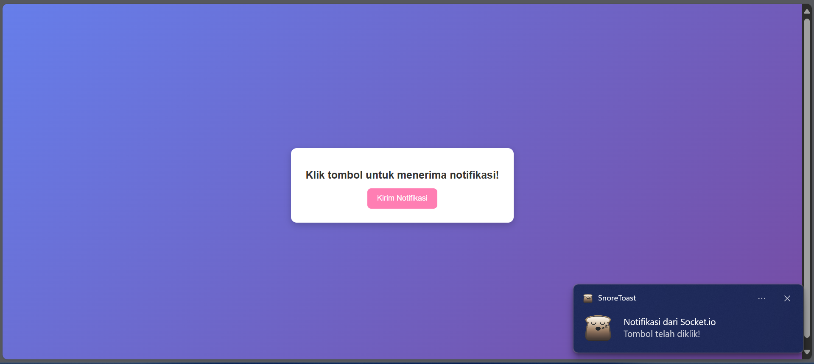

# Simple Socket.io Notifier

## 📌 Introduction
This project demonstrates how to send push notifications using **Socket.io** and **Node-Notifier**. Unlike traditional web-based push notifications that stop working when the browser is closed, this implementation ensures that notifications continue to be received on the device.

## 🚀 Features
- Real-time notification using **Socket.io**
- Desktop notifications using **Node-Notifier**
- Simple and lightweight setup without Firebase or OneSignal

## 📂 Project Structure
```
/simple-socket-notifier
│-- index.html   # Frontend UI with a button to trigger notifications
│-- server.js    # Backend using Express, Socket.io, and Node-Notifier
│-- package.json # Dependencies and scripts
```

## 🛠️ Technologies Used
- **Node.js**
- **Express.js**
- **Socket.io**
- **Node-Notifier**

## 📌 Installation
1. Clone this repository:
   ```sh
   git clone https://github.com/Cloud-Dark/simple_socket_notify
   cd simple_socket_notify
   ```
2. Install dependencies:
   ```sh
   npm install
   ```
3. Start the server:
   ```sh
   node server.js
   ```
4. Open the browser and go to:
   ```
   http://localhost:3000
   ```
5. Click the **Send Notification** button and check your device for notifications.

## 🎯 How It Works
1. The user clicks the button on `index.html`.
2. A **Socket.io** event is triggered and sent to the backend.
3. The backend uses **Node-Notifier** to send a desktop notification.
4. The user receives the notification even if the browser is closed (as long as the backend is running).

## 📸 Screenshot


## 📝 License
This project is open-source and available under the **MIT License**.

## 🤝 Contributing
Feel free to fork this repository and submit pull requests to improve it!

## 📬 Contact
If you have any questions, feel free to reach out.

Happy coding! 🚀

